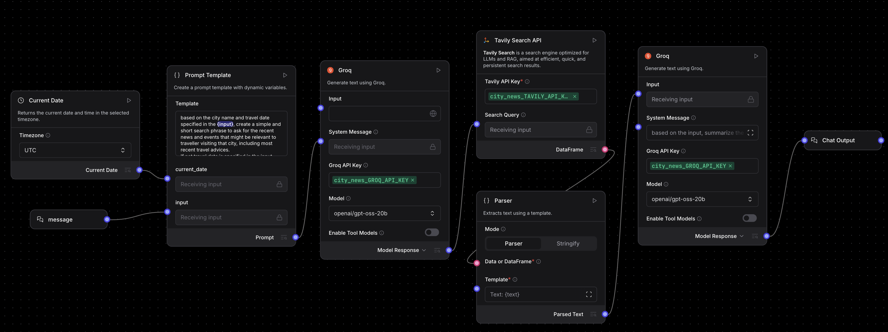
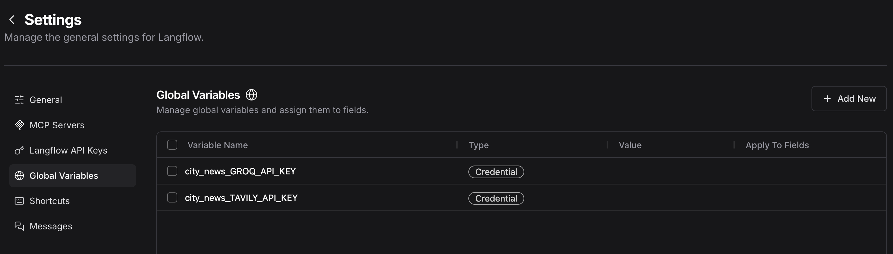
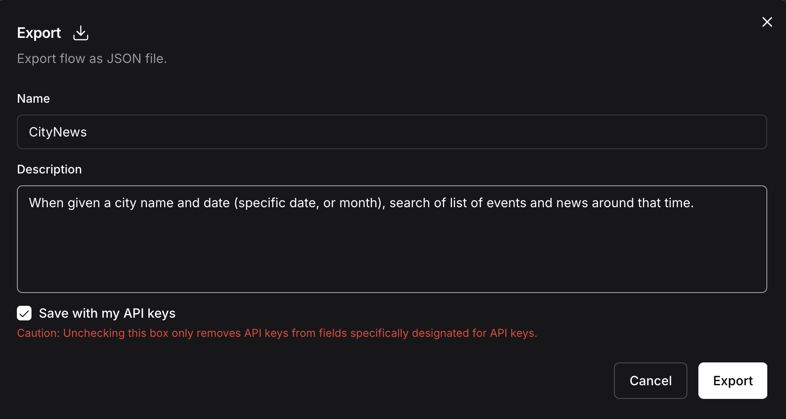

### Langflow as a tool in wxO

In this example, we have a langflow model `CityNews.json` that will search for
recent city news using Tavily and use LLM models hosted in Groq to summarize the result.

Before you start:
1. Start the ADK with Langflow `orchestrate server start -e .env --with-langflow`
1. Get API keys for Groq and Tavily.  You can use trial keys for this example.

### (optional) Import this example into Langflow and modify it

1. Go to `http://localhost:7861` to open the Langflow designer.
2. Import the file `CityNews.json` into the designer.  For more details, go to `https://docs.langflow.org/concepts-flows-import`.
3. Upon import of the model, Langflow will clear out all the API key settings and you will have to recreate them.  This is a known issue.

Here is the design:

After your change, make sure you map all all your API credentials to Langflow Global Variables:
The naming convention of the Global Variable must be <app_id>_<variable_name>

Then export the model with the API keys.  Make sure all the API keys are already mapped to Global Variables:

### Use Travel Advice agent with Langflow tool from wxO Chat

1. Create a `.env` file with the setting:
    1. `GROQ_API_KEY=<your groq api key>`
    2. `TAVILY_API_KEY=<your tavily api key>`
1. Run `import-all.sh` 
    1. As part of the script, we create an app-id `city_news` with the environment values and associate them with the Langflow tool.
1. Launch the Chat UI with `orchestrate chat start`
1. Pick the `travel_advice_agent`
1. Type in something like `New York on Oct 31`. The agent should response with a set of travel advices.

